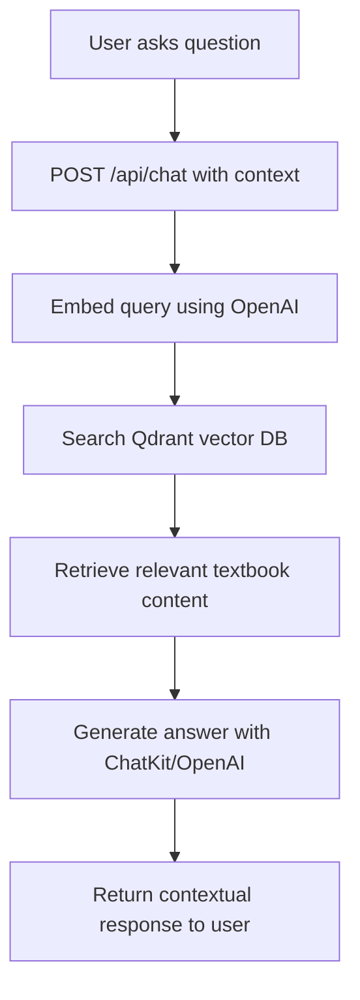

# Feature Specification: AI-Native Textbook with RAG Platform

**Feature Branch**: `001-textbook-rag-platform`
**Created**: 2025-12-19
**Status**: Draft
**Input**: User description: "Create AI-Native Textbook with RAG functionality for Physical AI & Humanoid Robotics, including Docusaurus site structure matching syllabus, authentication system with user metadata capture, personalization engine, localization features, and RAG chat functionality"

## User Scenarios & Testing *(mandatory)*

### User Story 1 - Access Interactive Textbook Content (Priority: P1)

As a student or professional interested in Physical AI & Humanoid Robotics, I want to access an interactive textbook that covers ROS 2, Gazebo, NVIDIA Isaac, and Vision-Language-Action systems so I can learn these concepts effectively.

**Why this priority**: This is the core value proposition of the platform - providing educational content in an accessible format. Without this, the platform has no purpose.

**Independent Test**: Can navigate through all 4 modules of the textbook and read the content without technical issues.

**Acceptance Scenarios**:

1. **Given** I am on the textbook homepage, **When** I click on "Module 1: The Robotic Nervous System (ROS 2)", **Then** I can read the content about Nodes, Topics, Services, URDF, and rclpy
2. **Given** I am reading a textbook chapter, **When** I use the sidebar navigation, **Then** I can move to different sections of the textbook seamlessly

---

### User Story 2 - Ask Questions via RAG Chatbot (Priority: P1)

As a learner, I want to ask questions about the textbook content to a chatbot that can reference the specific chapters so I can get contextual answers to my questions.

**Why this priority**: This is the key differentiator of the platform - the RAG functionality that allows users to interact with the textbook content in a conversational way.

**Independent Test**: Can ask a question about textbook content and receive an accurate answer that references the appropriate textbook material.

**Acceptance Scenarios**:

1. **Given** I am viewing a textbook chapter, **When** I ask the chatbot a question related to the content, **Then** I receive an answer based on the textbook content with proper context
2. **Given** I ask a question unrelated to the textbook, **When** the chatbot processes my query, **Then** it informs me that the answer is outside the textbook scope

---

### User Story 3 - Personalize Learning Experience (Priority: P2)

As a learner with a specific background, I want to personalize the textbook content to match my expertise level so I can learn more efficiently.

**Why this priority**: This enhances the learning experience by tailoring content to the user's background, making it more accessible and relevant.

**Independent Test**: Can click the Personalize button and see textbook content adapted to my background (e.g., "Explain this for a Python expert").

**Acceptance Scenarios**:

1. **Given** I have provided my background information during signup, **When** I click the Personalize button on a chapter, **Then** the content is re-written to match my expertise level
2. **Given** I am viewing personalized content, **When** I refresh the page, **Then** the personalization persists

---

### User Story 4 - Access Content in Different Languages (Priority: P2)

As a non-English speaker, I want to translate textbook content into my native language so I can better understand the material.

**Why this priority**: This makes the platform more accessible to a global audience, expanding its reach and impact.

**Independent Test**: Can click the Translate button and see the current page content in the selected language (Urdu).

**Acceptance Scenarios**:

1. **Given** I am viewing textbook content in English, **When** I click the Translate button and select Urdu, **Then** the content is displayed in Urdu
2. **Given** I have translated content, **When** I navigate to another page, **Then** I can translate that page as well

---

### User Story 5 - Create and Manage Account (Priority: P3)

As a user, I want to create an account and save my learning progress so I can continue my studies across different sessions.

**Why this priority**: This enables personalization features and allows for tracking user progress, which enhances the learning experience.

**Independent Test**: Can sign up with email, provide background information, and log back in to access my account.

**Acceptance Scenarios**:

1. **Given** I am a new user, **When** I sign up and provide my background information, **Then** my profile is created with the metadata stored
2. **Given** I have an account, **When** I log in, **Then** I can access my personalized learning experience

---

### Edge Cases

- What happens when the RAG system cannot find relevant textbook content for a user's query?
- How does the system handle translation requests when the translation service is unavailable?
- What happens when a user tries to personalize content but doesn't have background information in their profile?
- How does the system handle concurrent users asking questions simultaneously?

## Requirements *(mandatory)*

### Functional Requirements

- **FR-001**: System MUST provide a Docusaurus-based interactive textbook with the specified syllabus structure
- **FR-002**: System MUST implement a RAG chatbot that answers questions based on textbook content
- **FR-003**: System MUST capture user background information ("Software Background" and "Hardware Background") during signup
- **FR-004**: System MUST provide a PersonalizeButton UI component that re-writes content based on user profile
- **FR-005**: System MUST provide a TranslateButton UI component that translates content to Urdu
- **FR-006**: System MUST implement Better Auth for user authentication
- **FR-007**: System MUST store user data in a Neon Postgres database
- **FR-008**: System MUST store chat logs with user_id, query, response, and timestamp
- **FR-009**: System MUST provide a POST /api/chat endpoint that handles RAG queries
- **FR-010**: System MUST provide a POST /api/personalize endpoint that returns personalized markdown
- **FR-011**: System MUST integrate with Qdrant for vector search functionality
- **FR-012**: System MUST use OpenAI or ChatKit for response generation

### Site Structure & Content Hierarchy (Docusaurus)

The Docusaurus sidebar structure MUST match this syllabus:

```javascript
// sidebars.js
module.exports = {
  textbook: [
    {
      type: 'category',
      label: 'Module 1: The Robotic Nervous System (ROS 2)',
      items: [
        'module1/intro-ros2',
        'module1/nodes-topics-services',
        'module1/urdf',
        'module1/rclpy',
      ],
    },
    {
      type: 'category',
      label: 'Module 2: The Digital Twin (Gazebo & Unity)',
      items: [
        'module2/intro-digital-twin',
        'module2/physics-simulation',
        'module2/lidar-camera-simulation',
        'module2/unity-integration',
      ],
    },
    {
      type: 'category',
      label: 'Module 3: The AI-Robot Brain (NVIDIA Isaac)',
      items: [
        'module3/intro-ai-robot-brain',
        'module3/isaac-sim',
        'module3/isaac-ros',
        'module3/nav2',
        'module3/vslam',
      ],
    },
    {
      type: 'category',
      label: 'Module 4: Vision-Language-Action (VLA)',
      items: [
        'module4/intro-vla',
        'module4/voice-to-action-whisper',
        'module4/cognitive-planning-llms',
        'module4/llms-to-ros2',
      ],
    },
    {
      type: 'category',
      label: 'Capstone Project: The Autonomous Humanoid',
      items: [
        'capstone/intro-autonomous-humanoid',
        'capstone/integration-challenges',
        'capstone/project-implementation',
      ],
    },
  ],
};
```

### Feature Specifications (The "Bonuses")

- **FR-013**: System MUST implement Better Auth integration for user authentication
- **FR-014**: System MUST capture user metadata ("Software Background" and "Hardware Background") during signup
- **FR-015**: System MUST provide a UI component (`<PersonalizeButton />`) that re-writes the current chapter based on the user's metadata (e.g., "Explain this for a Python expert")
- **FR-016**: System MUST provide a UI component (`<TranslateButton />`) that translates the current page content into Urdu

### Backend Architecture (FastAPI + RAG)

- **FR-017**: System MUST provide a POST /api/chat endpoint that handles RAG queries with input: User message and Current Chapter Context
- **FR-018**: The /api/chat endpoint process MUST: Embed query -> Search Qdrant -> Generate Answer via ChatKit/OpenAI
- **FR-019**: System MUST provide a POST /api/personalize endpoint with input: Page content and User Profile, output: Personalized Markdown
- **FR-020**: System MUST implement a database schema with table: `users` (id, email, background_info)
- **FR-021**: System MUST implement a database schema with table: `chat_logs` (user_id, query, response, timestamp)

### Implementation Steps (The "ToDo" List)

- **FR-022**: Sprint 1 MUST involve scaffolding Docusaurus and creating Markdown files for all 4 Modules
- **FR-023**: Sprint 2 MUST involve setting up FastAPI backend, Neon DB connection, and Qdrant ingestion script
- **FR-024**: Sprint 3 MUST involve implementing the RAG Chatbot widget in React and connecting to backend
- **FR-025**: Sprint 4 MUST involve implementing Bonus Features (Auth, Translation, Personalization buttons)

### Key Entities

- **User**: Represents a registered user with email, software background, hardware background, and account metadata
- **ChatLog**: Represents a conversation record with user_id, query, response, and timestamp
- **Chapter**: Represents a textbook chapter with content that can be personalized and translated
- **Module**: Represents a collection of chapters covering a specific topic (ROS 2, Gazebo, etc.)

## Success Criteria *(mandatory)*

### Measurable Outcomes

- **SC-001**: Users can navigate through all 4 textbook modules and access content within 3 seconds of page load
- **SC-002**: 90% of user questions receive relevant answers from the RAG system within 10 seconds
- **SC-003**: Users can successfully sign up and provide background information in under 2 minutes
- **SC-004**: Translation feature successfully converts textbook content to Urdu with 85% accuracy
- **SC-005**: Personalization feature adapts content to user's background in 90% of requests
- **SC-006**: System can handle 100 concurrent users asking questions simultaneously without performance degradation
- **SC-007**: 80% of users who try the personalization feature use it regularly in their learning journey

### RAG Flow Visualization


